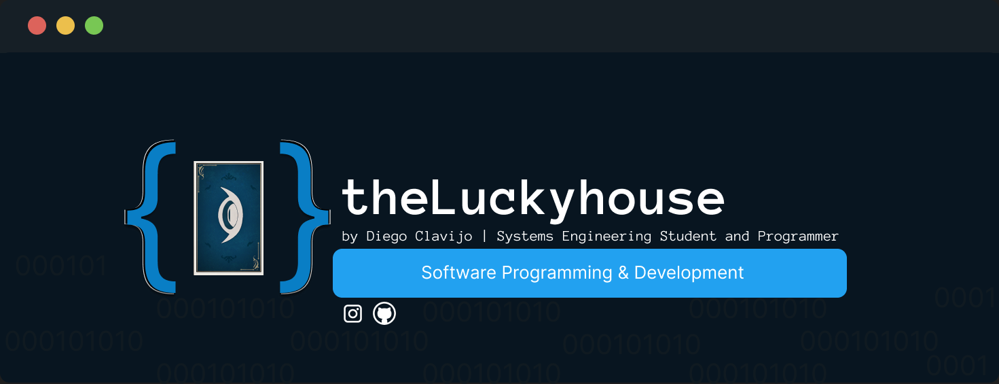

#  Hi, my name is Diego Clavijo👋
### I am a systems engineering student

 
<h2>About me 😃</h2>
<!--Intro start-->

### I have been a Systems Engineering student since 2023. 
### I have started to make modifications to my profile as proof and proof of my upcoming projects. 
### I like to learn new things and I want to share everything I learn. 

## Find me at:

<!--Intro end-->
  

 
<h2 >Known technologies👨🏻‍💻</h2>

<!--tech stack icons-->

  

 

# Some projects

# Soon...

<h2>My GitHub Stats :jack_o_lantern:</h2>
<!--- stats & Trophy (start) -->

  <!--- stats (start) -->
<table align="left">
<tr border="none">
<td width="60%" align="center">

<!--  
     -->
   
</td>

<td width="40%" align="center">

  

  </td>
</tr>
</table>
<!--- stats (end) -->

